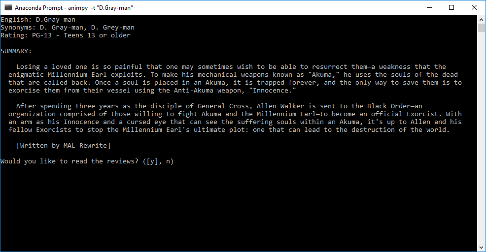
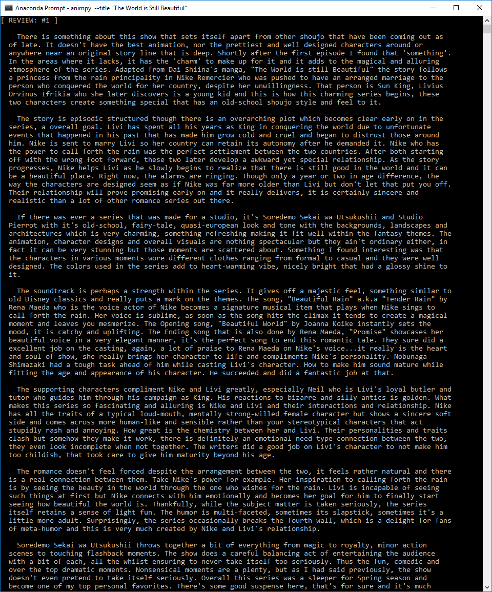

# Anime Python Research Tool (animpy)
> Just a little tool to make it easier for me to look up anime reviews.

![Python version][python-version]
[![Build Status][travis-image]][travis-url]
[![BCH compliance][bch-image]][bch-url]
[![GitHub issues][issues-image]][issues-url]
[![GitHub forks][fork-image]][fork-url]
[![GitHub Stars][stars-image]][stars-url]
[![License][license-image]][license-url]

My kids are big movie and anime buffs and are constantly asking me to look up shows to see if they are allowed to watch them. This of course takes time, more so when they bring you a list of them!

I initially wrote [Parental Guide (pguide)](https://github.com/clamytoe/pguide.git) but IMDb isn't really the greatest place to find reviews for anime. That lead me to start from scratch, so I created this one that scrapes [MyAnimeList](https://myanimelist.net) instead.

## How to set it all up
First of all, you should setup a virtual environment. I've included both a *requirements.txt* and an *environment.yml* file in order to make things easier. Perform the steps in the *Initial* and *Final* setups but do either the *Anaconda* or *Python* ones depending on which one you prefer to work with.

#### Initial setup
```bash
cd Projects
git clone https://github.com/clamytoe/animpy.git
cd animpy
```

#### Anaconda setup
```bash
conda env create
```

#### Regular Python setup
```bash
pip install -r requirements.txt
```

#### Final setup
```bash
activate animpy # or source activate animpy
pip install -e .
```

## How to run
Once that's all out of the way there are two ways to start the script.

### Method #1
```bash
animpy
```

You will be prompted for the title.

### Method #2
```bash
animpy -t "the world is beautiful"

# or

animpy --title "the world is beautiful"
```

## Sample run




Just hitting the *ENTER* key will continue with the next screen. To exit enter an *n*.

[python-version]:https://img.shields.io/badge/python-3.6.3-brightgreen.svg
[travis-image]:https://travis-ci.org/clamytoe/animpy.svg?branch=master
[travis-url]:https://travis-ci.org/clamytoe/animpy
[bch-image]:https://bettercodehub.com/edge/badge/clamytoe/animpy?branch=master
[bch-url]:https://bettercodehub.com/
[issues-image]:https://img.shields.io/github/issues/clamytoe/animpy.svg
[issues-url]:https://github.com/clamytoe/animpy/issues
[fork-image]:https://img.shields.io/github/forks/clamytoe/animpy.svg
[fork-url]:https://github.com/clamytoe/animpy/network
[stars-image]:https://img.shields.io/github/stars/clamytoe/animpy.svg
[stars-url]:https://github.com/clamytoe/animpy/stargazers
[license-image]:https://img.shields.io/github/license/clamytoe/animpy.svg
[license-url]:https://github.com/clamytoe/animpy/blob/master/LICENSE
