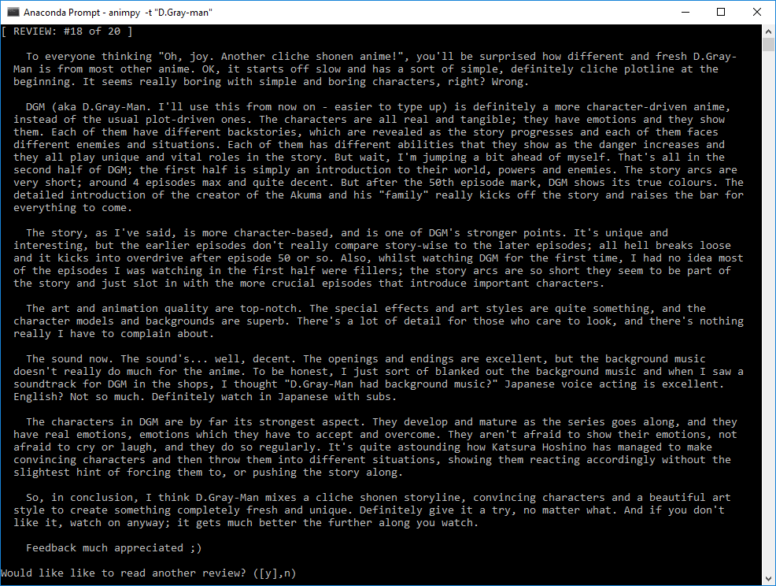

# Anime Python Research Tool (animpy)
> Just a little tool to make it easier for me to look up anime reviews.

![Python version][python-version]
![Latest version][latest-version]
[![Build Status][travis-image]][travis-url]
[![BCH compliance][bch-image]][bch-url]
[![GitHub issues][issues-image]][issues-url]
[![GitHub forks][fork-image]][fork-url]
[![GitHub Stars][stars-image]][stars-url]
[![License][license-image]][license-url]

My kids are big movie and anime buffs and are constantly asking me to look up shows to see if they are allowed to watch them. This of course takes time, more so when they bring you a list of them!

I initially wrote [Parental Guide (pguide)](https://github.com/clamytoe/pguide.git) but IMDb isn't really the greatest place to find reviews for anime. That lead me to start from scratch, so I created this one that scrapes [MyAnimeList](https://myanimelist.net) instead.


## Requirements
1. Requires Python 3.6
2. Requires all the packages *you* need in order to install **animpy** into your preferred flavor of virtual environment (of the three mentioned in the steps below that is).


## How To Set It All Up
Use a virtual environment. A *requirements.txt* and an *environment.yml* file are included already, along with the files *Pipfile* and *Pipfile.lock* if you'd like to use Pipenv. Perform the steps in the *Initial Setup* to clone the repo and then choose whichever set of *Setup* instructions for the virtual environment you prefer to work with.

### Initial Setup: Cloning the Repo
1. Create and then change into the directory you would like to install **animpy** into.
   - `mkdir <directory name>`
   - `cd <directory name>`
   - `git clone https://github.com/clamytoe/animpy.git`
   - `cd animpy`

### Anaconda Setup
1. `conda env create` (creates the virtual environment)
2. `activate animpy` or `source activate animpy` (activates the virtual environment)
3. `pip install -e .` (installs the animpy package)

### Regular Python 3 Virtual Environment Setup
1. `python3 -m venv </path/to/new/virtual/environment>` (creates the virtual environment)
2. `source </path/to/new/virtual/environment>/bin/activate` (activates the virtual environment)
3. `pip install -r requirements.txt` (installs all required dependencies)
4. `pip install -e .` (installs the animpy package)

### Pipenv Setup
1. `pipenv install` (creates the virtual environment, installs all dependencies from Pipfile.lock, and installs the animpy package)
2. `pipenv shell` (activates the virtual environment)


## How To Use
Once you've installed **animpy** into your virtual environment, using the script is pretty straight forward. If you use the *--help* flag it will display the following usage statement:

```bash
Usage: animpy [OPTIONS]

  Entry point for the script, requires the title of the Anime to look up.

  If a title is not given from the command line, one will be asked for.
  :param title: String, the title of the show :return: None

Options:
  --show / --no-show   Toggles display search results on/off, defaults to off.
  -c, --count INTEGER  Number of search results to display, default is 5.
  -t, --title TEXT     Title of the Anime that you would like to look up, use
                       double-quotes.
  --help               Show this message and exit.
  ```

### Method #1
```bash
animpy
```

You will be prompted for the title.

### Method #2
```bash
animpy -t "D.Grey-man"

# or

animpy --show --count 2 --title "D.Gray-man"
```


## Sample run
> Notice that even if there is a type-o in the search term, the correct show is still found.




Just hitting the *ENTER* key will continue with the next screen. To exit enter an *n*.

[python-version]:https://img.shields.io/badge/python-3.6-brightgreen.svg
[latest-version]:https://img.shields.io/badge/version-0.4.0-blue.svg
[travis-image]:https://travis-ci.org/clamytoe/animpy.svg?branch=master
[travis-url]:https://travis-ci.org/clamytoe/animpy
[bch-image]:https://bettercodehub.com/edge/badge/clamytoe/animpy?branch=master
[bch-url]:https://bettercodehub.com/
[issues-image]:https://img.shields.io/github/issues/clamytoe/animpy.svg
[issues-url]:https://github.com/clamytoe/animpy/issues
[fork-image]:https://img.shields.io/github/forks/clamytoe/animpy.svg
[fork-url]:https://github.com/clamytoe/animpy/network
[stars-image]:https://img.shields.io/github/stars/clamytoe/animpy.svg
[stars-url]:https://github.com/clamytoe/animpy/stargazers
[license-image]:https://img.shields.io/github/license/clamytoe/animpy.svg
[license-url]:https://github.com/clamytoe/animpy/blob/master/LICENSE
